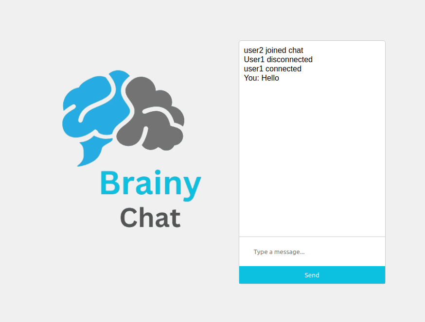

# Brainy Chat



Brainy Chat is a real-time chat application with support for multiple chat rooms.

## 📋 Table of Contents

- [✨ Features](#-features)
- [🛠 Tech Stack](#-tech-stack)
- [📦 Setup and Installation](#-setup-and-installation)
- [🚀 Usage](#-usage)
- [📂 Project Structure](#-project-structure)
- [📧 Contact](#-contact)

## ✨ Features

- Real-time chat with Socket.IO
- Support for multiple chat rooms
- User-friendly interface using EJS templates

## 🛠 Tech Stack

- **Frontend:** HTML, CSS, JavaScript, EJS
- **Backend:** Node.js, Express, Socket.IO

## 📦 Setup and Installation

### Prerequisites

- Node.js (v20.15.0 or higher)
- npm (Node Package Manager)

### Installation

1. **Clone the repository:**

   ```bash
   git clone https://github.com/KhoshfekrMH/brainy-chat
   cd brainy-chat
   ```

2. **Install dependencies:**

   ```bash
   npm install
   ```

3. **Run the server:**

   ```bash
   cd backend
   nodemon server.js
   ```

4. **Open your browser and navigate to:**

   ```
   http://localhost:3000
   ```

## 🚀 Usage

1. **Creating a New Room:**
    - Enter a room name in the input field on the home page and click "New Room".
    - You will be redirected to the newly created room.

2. **Joining an Existing Room:**
    - Click on the "Join" link next to an existing room on the home page.

3. **Chatting:**
    - Enter your username when prompted.
    - Type your message in the input field and click "Send" or press "Enter" to send the message.

## 📂 Project Structure

```
brainy-chat/
│
├── backend/
│   ├── server.js       # Main server file
│   ├── package.json    # Server dependencies
│
├── frontend/
│   ├── public/
│   │   ├── css/
│   │   ├── images/
│   │   ├── script.js   # Client-side JavaScript
│   │
│   ├── views/
│   │   ├── index.ejs   # Home page template
│   │   └── room.ejs    # Chat room template
│   │
│   └── package.json    # Client dependencies
│
└── README.md           # Project documentation
```

## 📧 Contact

For any questions or feedback, please contact [Khoshfekr](mailto:khoshfekr2001@protonmail.com).

---

Adjust the details, especially the repository URL and contact information, to match your actual project specifics.
